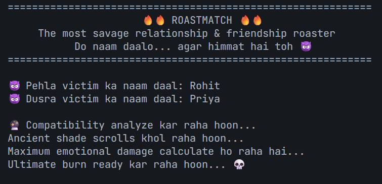
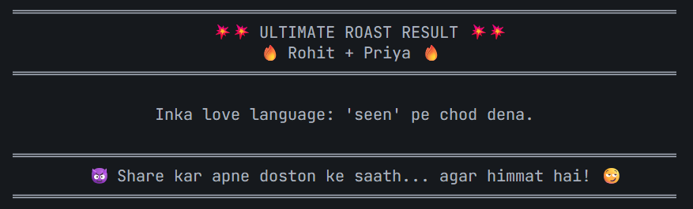
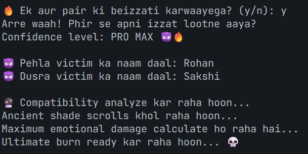
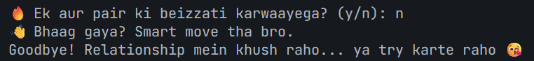

# **RoastMatch**
A savage, text-based relationship & friendship roaster built in Python.

Enter any two names — friends, couple, siblings, celebrities — and get a brutally honest (but fake) Hinglish roast about their compatibility.  
Same names = same roast every time. Different names = fresh shade!

Perfect mix of humor, sarcasm, and desi relatability

## **Features**
- 50+ hand-crafted savage Hinglish roasts
- Deterministic algorithm (same names → same roast for shareability)
- Clean Object-Oriented design (3 classes: GameController, RoastEngine, UserInterface)
- Dramatic UI with suspense, borders, emojis, and attitude
- Input validation (no crashes on empty names)
- Replayable with sarcastic messages

## **Screenshot / Example Output**





## **How to Run**

1. Make sure you have Python 3 installed
2. Save the code as `roastmatch.py`
3. Run it:

```bash
python roastmatch.py
```
4. Enter two names and enjoy the roast.

## **Built For Learning**
This project was created to practice:

  *Clean project structure & planning*
  *Purposeful Object-Oriented Programming*
  *Separation of concerns*
  *Dependency injection*
  *User experience & polish*
  *Deterministic "randomness"*

No external libraries — pure Python!

## **Made By**
Raj Tiwari / rajcodes-dev
Feel free to fork, share, and roast your friends!

### ***Warning: May cause laughter, eye-rolls, and minor emotional damage.*** ###
